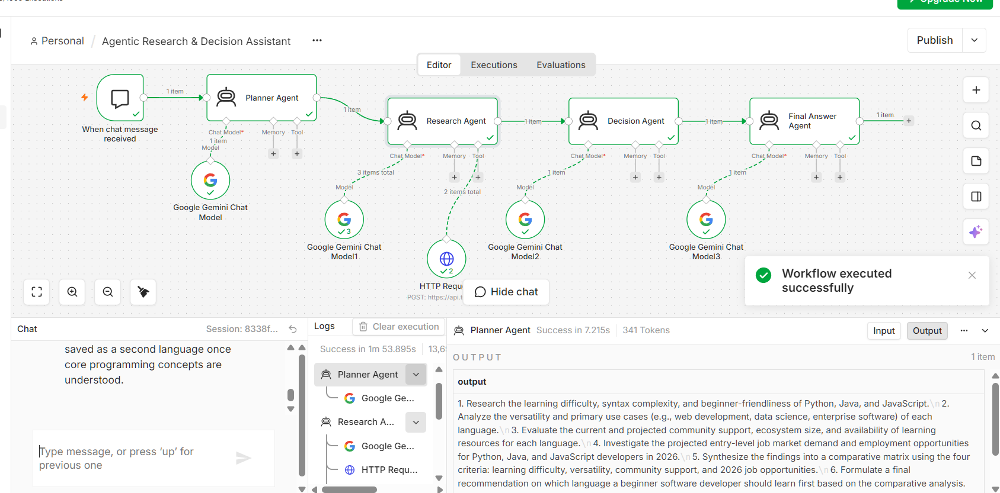

# Agentic Research & Decision Assistant

An AI-powered agentic research and decision assistant built using n8n, Google Gemini, and Tavily.

The system takes a user's request, creates a research plan, gathers relevant web information, evaluates the evidence, and produces a clear, evidence-based final answer.

## Project Overview

This project demonstrates a multi-agent AI workflow where different AI agents perform different stages of the decision-making process.

Instead of using a single AI prompt to answer a question, the workflow separates planning, research, evaluation, and final response generation into dedicated agents.

## Workflow Architecture

User Request
↓
Planner Agent
↓
Research Agent
↓
Tavily Web Search
↓
Decision Agent
↓
Final Answer Agent

## How It Works

### 1. Planner Agent

The Planner Agent understands the user's request and breaks it into smaller research tasks.

It identifies:
- Information that needs to be collected
- Research tasks
- Comparison criteria
- Verification requirements

### 2. Research Agent

The Research Agent executes the research plan.

It gathers relevant and current information using the Tavily Web Search tool and organizes the findings for further evaluation.

### 3. Decision Agent

The Decision Agent analyzes the research findings.

It:
- Compares available options
- Evaluates advantages and disadvantages
- Identifies risks and trade-offs
- Provides evidence-based reasoning
- Makes a recommendation when appropriate

### 4. Final Answer Agent

The Final Answer Agent converts the decision and reasoning into a clear and concise response for the user.

It presents:
- The direct answer
- Key findings
- Comparison
- Recommendation
- Important limitations

## Technologies Used

- n8n
- Google Gemini
- Tavily
- AI Agents
- Web Search
- Prompt Engineering
- REST API

## Key Features

- Multi-agent AI architecture
- Automated research planning
- Real-time web research
- Evidence-based decision making
- Tool-using AI agent
- Structured final responses
- Separation of planning, research, decision and response generation

## Why This Is Agentic AI

The workflow is agentic because it does more than generate a response from a single prompt.

It follows a sequence of autonomous tasks:

1. Understand the user's goal
2. Create a research plan
3. Gather external information
4. Evaluate the collected evidence
5. Make a decision
6. Generate the final response

Each stage has a specific responsibility and passes its output to the next stage.

## Example Use Case

A user can ask the assistant to compare different technologies, tools, learning paths, or other options where current information and evidence are important.

For example:

> Compare Python, Java, and JavaScript and recommend which one I should learn first based on learning difficulty, versatility, community support, and entry-level job opportunities.

The system researches the relevant information, evaluates the options, and provides a reasoned recommendation.

## Project Screenshot

## Security

Sensitive API credentials are not included in the public workflow export.

The GitHub workflow file uses a placeholder for the Tavily API key.

Before importing the workflow, configure your own Tavily API credentials in n8n.

## Future Improvements

- Add more research sources
- Add citation formatting
- Add persistent memory
- Add specialized research agents
- Add automated report generation
- Add support for additional AI models
- Improve source verification
